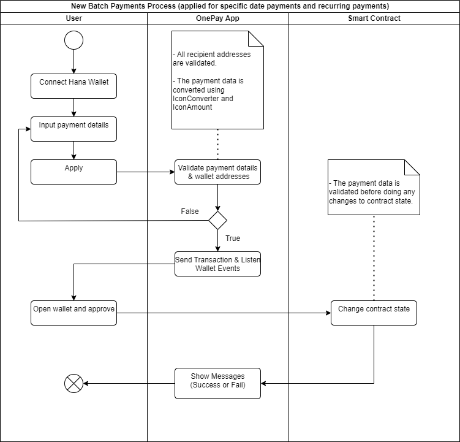
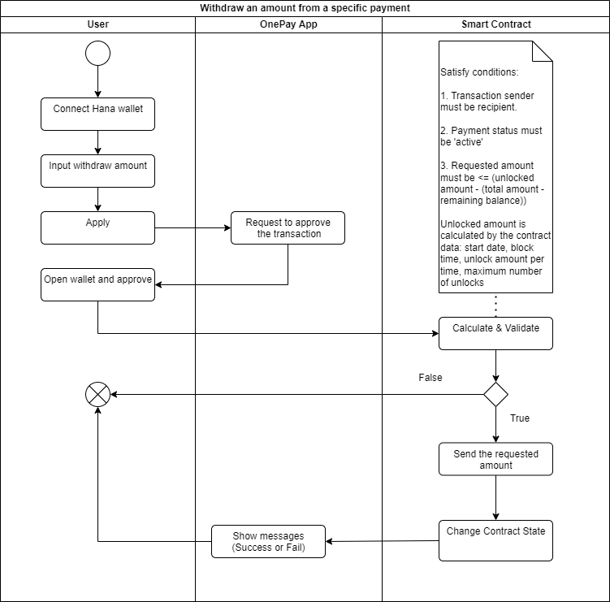
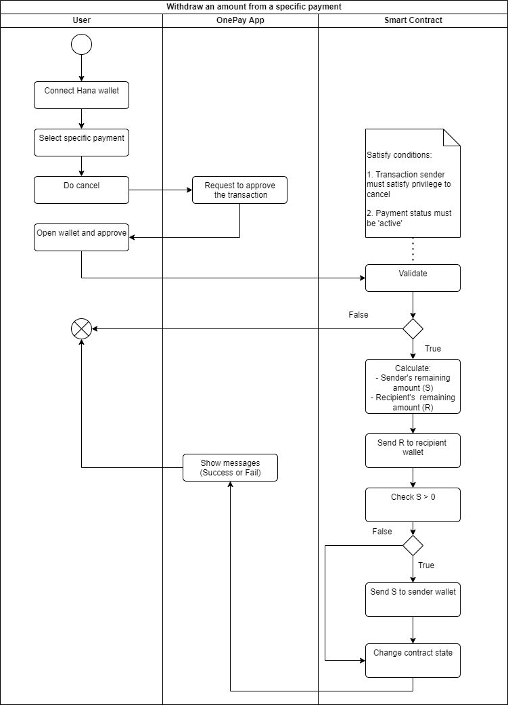
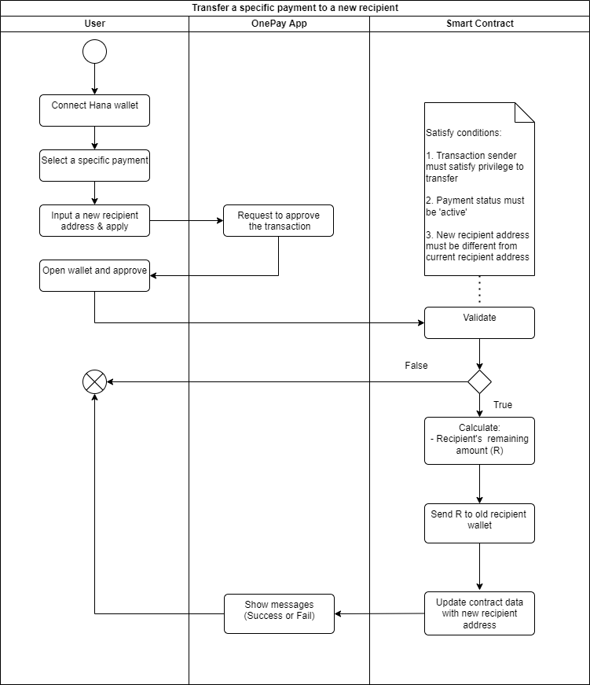

# **ONEPAY** - Automate Salaries & Recurring Payments
## Description
With ONEPAY, users can create batch payments with a variety of options, including instant payments, payments scheduled for a specific date, and recurring payments. These features can be utilized to pay wages, distribute tokens, and generate invoices.

Web URL: [OnePay](https://onepay.a2n.finance) (Lisbon Testnet)
Smart Contract Address: [OnePay](https://lisbon.tracker.solidwallet.io/contract/cx1eec86a2e2de2cd73e3e80e48deaa703e317d6c0#code)

## Getting Started
These are instructions on how to install and run your dApp. Include prerequisites, installation steps, and commands needed to start the application.

### Prerequisites
- Have basic knowledge about Javascript & React App.
- NodeJS 16+
- A [Hana Wallet](https://chrome.google.com/webstore/detail/hana-wallet/jfdlamikmbghhapbgfoogdffldioobgl) account.

### Installation Steps
- Copy .env.example to .env.local
- Change settings in .env.local
    - `NEXT_PUBLIC_DATABASE_URL`: your cloud database url.
    - `NEXT_PUBLIC_NET_ENV`: tesnet or mainnet.
- Install dependencies: `npm i`

### Commands to start 
- Go into folder `contracts/icon/`
- To compile the smart contract: `./gradlew build`
- To optimize the smart contract: `./gradlew optimizedJar`
- To run unit tests: `./gradlew test`
- To deploy OnePay smart contract to Lisbon Testnet: `./gradlew onepay:deployToLisbon -PkeystoreName="your_exported_key_store" -PkeystorePass=YourPassword`
- Run this app on Dev mode: `npm run dev`
- Run this app on Production mode: `npm run build` and `npm run start`

## Technologies Used
List the technologies and tools used to build this app, including programming languages, frameworks, and libraries.

### Programming languages
- Javascript
- Java
- TypeScript
### Frameworks
- React 18
- NextJS 12.1
### Libraries
- ICON Foundation Java libs to build smart contracts & unit tests.
- ICON Javascript SDK: to interact with SmartContract & Wallet.
- Charka UI Components: to develop UI/UX.

## Smart Contracts
Our main smart contract is OnePay.

### Creat Batch Payments Proccess

This workflow demonstrates how smart contracts are deployed to facilitate both one-time payments on a scheduled date and recurring payments.

### Withdraw Token Process

### Cancel Payment Proccess

### Transfer Payment Proccess

## Usage
To use this app on any web browser, use this url: [https://onepay.a2n.finance](https://onepay.a2n.finance)

To create instant batch payments for immediate or specific date transactions, click on the menu `Payments => One-Time Payments`

To pay wages or disburse tokens as an investor, click on the menu `Payments => Recurring Payments`

To issue an invoice, click on the menu `Invoice => New Invoice`

## Contributing
While this application is functional, there are areas that can still be improved, such as UI/UX, security, and smart contract functionality, as well as adding new features. We welcome any ideas or suggestions to help us make this app better. Please do not hesitate to contact us via email at john@a2n.finance.

## Acknowledgments
Our team would like to extend our gratitude to the ICON Community, ICON Foundation open-source projects, and the dev channel on Discord. We recognize that without the support and access to high-quality libraries provided by the ICON Community, our team would not have been able to successfully develop and complete this application.

## Contact

If you have any questions, please do not hesitate to contact us via email at john@a2n.finance.

## License
This package is released under the BSL 1.1 License.